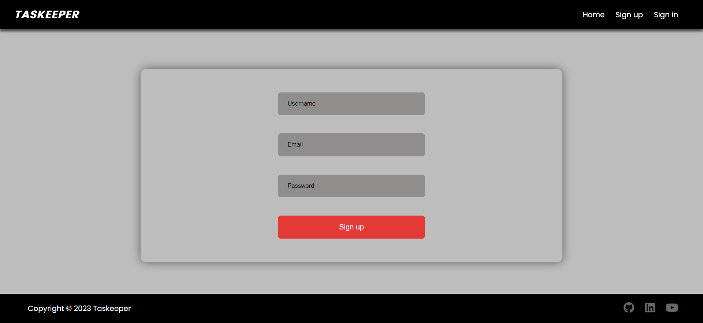
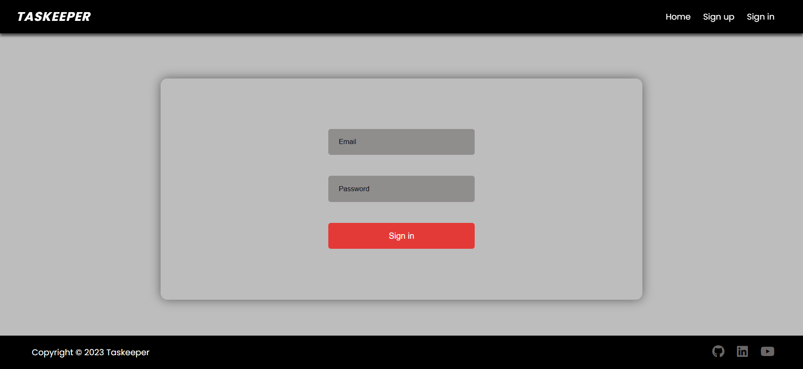
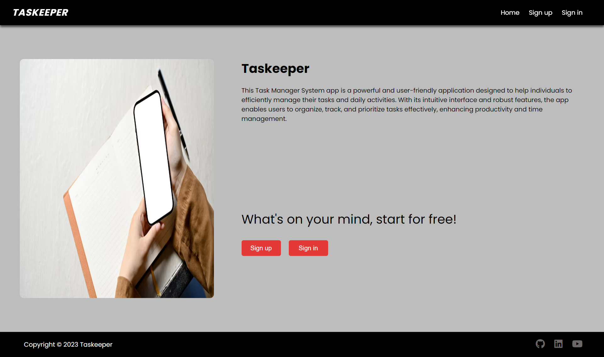
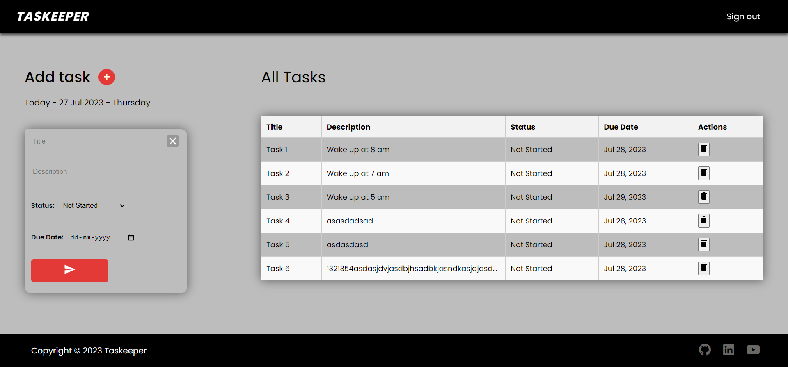

<div align="center">
<h3 align="center">TASKEEPER MERN APP</h3>
    <a href="https://taskeeper.vercel.app">View website</a>
    <br />
    <br />
</div>

## Resources

- [MongoDB](https://www.mongodb.com)
- [Express](https://expressjs.com)
- [React.js](https://react.dev)
- [Node.js](https://nodejs.org)
- [Mongoose](https://mongoosejs.com)
- [Material UI](https://mui.com)
- [SASS](https://sass-lang.com)
- [JSON Web Token](https://jwt.io)
- [Axios](https://axios-http.com)
- [Formik](https://formik.org)
- [Yup](https://www.npmjs.com/package/yup)
- [React Toastify](https://www.npmjs.com/package/react-toastify)

## Preview

  
  
  


## Getting Started

To get a local copy up and running follow these simple steps.

### Installation

- Clone the repository

```
git clone https://github.com/Amar7021/fullstack-mern-netflix-clone-2023.git
```

- Install NPM packages

```
cd fullstack-mern-netflix-clone-2023
cd server
npm install  // to install API dependencies
cd ..
cd client
npm install  // to install client dependencies
```

- Run server and front end

```
cd ..
cd server
nodemon start  // to start server
cd ..
cd client
npm start  // to start client side
```

## How to use

- [Sign up](https://taskeeper.vercel.app/signup) at first user needs to register using email, username and password.
- [Sign in](https://taskeeper.vercel.app/signin) user needs to login with the credentials used for registeration i.e email and password.
- User can create his tasks by clicking on add tasks a form will apear where user needs to type the name of the task, description, select the status and due date then click on submit button. The user can keep track of his tasks, update and delete if he want.
- User can sign out by clicking on sign out option in the navbar.

## Connect with me

[LinkedIn](https://www.linkedin.com/in/amar-belkar-7806101b2/)  
[Gmail](mailto:amarhere1122@gmail.com)
